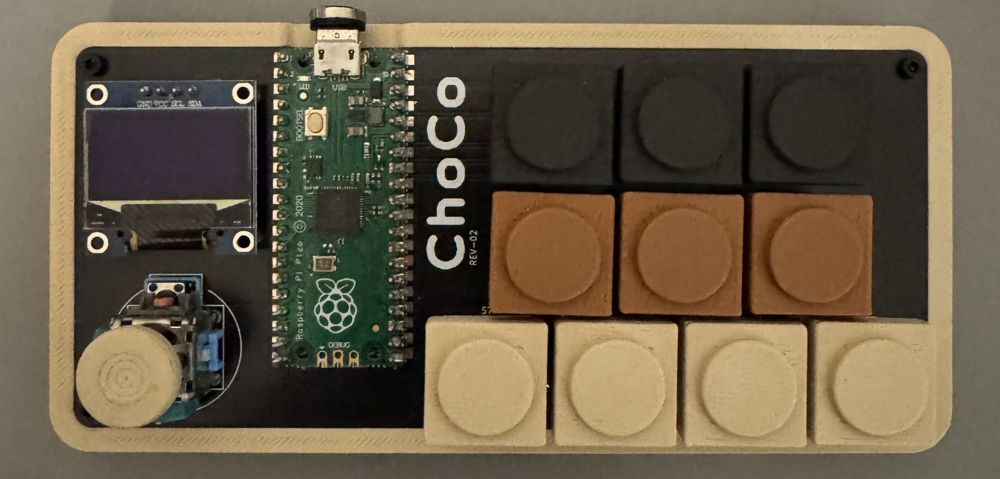
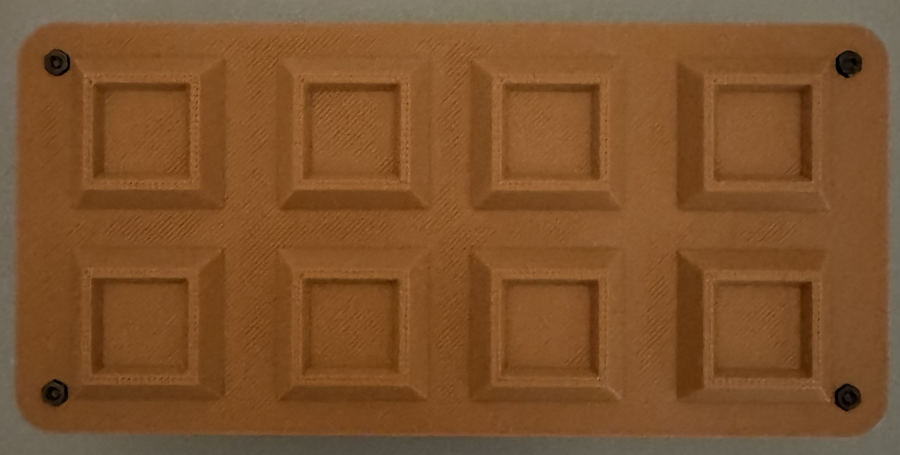

# ChoCo

**A USB MIDI chord controller built around a Raspberry Pi Pico.**

Choose a scale, hold a degree key, and move the joystick to change the chord. ChoCo sends MIDI notes to a software instrument, DAW, or compatible MIDI host; the connected instrument produces the sound. The OLED shows the current chord and playing modes.

[Website](https://enric0r.github.io/choco.github.io/) · [English handbook](https://enric0r.github.io/choco.github.io/docs/) · [Guida in italiano](https://enric0r.github.io/choco.github.io/it/docs/) · [Releases](https://github.com/enric0r/ChoCo/releases)

<p align="center">
  
  
</p>

## What you can play

- **Chords in a scale.** Seven degree keys select diatonic chords. Change the root note and choose from nine scales.
- **Chord variations.** Move the joystick for suspensions, sevenths, extensions and other variations. Return it to the center for the base triad.
- **Different ways to play.** Use latch to sustain a chord, add a bass note, stagger notes with strum, or switch to single notes.
- **Inversions and voicing.** Store an inversion for each degree or enable smart voicing.
- **Feedback on the device.** The 128×64 OLED shows key, scale, chord, mode badges and harmonic suggestions.

ChoCo sends class-compliant USB MIDI through TinyUSB. This repository contains the firmware and KiCad hardware files.

## Play your first chord

For an assembled controller:

1. Install the firmware if needed. Download a UF2 from [Releases](https://github.com/enric0r/ChoCo/releases), when available, or [build it below](#build-and-flash).
2. Connect ChoCo with a USB **data** cable.
3. Select its USB MIDI input in your DAW or MIDI host and load an instrument.
4. Hold key `0` to play the first degree of the selected scale.
5. Move the joystick while holding the key, then return it to the center to hear the base chord again.

Start with the [English setup guide](https://enric0r.github.io/choco.github.io/docs/#get-started) or [guida italiana](https://enric0r.github.io/choco.github.io/it/docs/#get-started) for the full walkthrough.

## Controls at a glance

The two upper rows sit halfway between the four white keys. Labels below follow the firmware:

```text
  A   B   C
  1   3   5
0   2   4   6
```

| Control | Action |
| --- | --- |
| `0–6` | Play one of the seven scale degrees |
| `A` | Raise the root by one semitone |
| `B` | Select the next scale |
| `C` | Hold as a modifier for shortcuts |
| Joystick tilt, with a degree held | Change the chord variation |
| `C` + `0–6` | Cycle the inversion for that degree |
| `C` + `A` | Toggle chord latch when A is released; cancelled if the joystick button is used for strum |
| Joystick short press, without `C` | Stop the chord and cancel pending strum notes, keeping the selected modes |
| Joystick long press, without `C` | Toggle single-note mode |

The [illustrated control map](https://enric0r.github.io/choco.github.io/docs/#controls) covers bass, strum, octave changes and the other shortcuts. See [chord variations](https://enric0r.github.io/choco.github.io/docs/#shape-a-chord) for the three joystick maps and [modes and display](https://enric0r.github.io/choco.github.io/docs/#modes-and-display) for the OLED guide.

## Build and flash

Install PlatformIO, then open this repository in a terminal or in VS Code with the PlatformIO extension. The firmware uses the Arduino RP2040 core and the `pico` environment.

```powershell
pio run
```

The UF2 file is written to `.pio/build/pico/firmware.uf2`. To install it:

1. Disconnect the Pico.
2. Hold **BOOTSEL** while connecting it over USB.
3. Copy the UF2 to the **RPI-RP2** drive. The board restarts automatically.

You can also upload through PlatformIO:

```powershell
pio run -t upload
```

`platformio.ini` sets `upload_port = COM5` for local development. Override it locally if your board uses another port. Keep the TinyUSB and network-disable build flags: they are required for this USB MIDI setup.

Serial logging is disabled by default. For diagnostics, set `CHOCO_LOG_LEVEL` in [Config.h](lib/Config/Config.h), rebuild, and run `pio device monitor`. See [DEBUGGING.md](DEBUGGING.md) for the diagnostic steps.

## Hardware and configuration

The prototype uses a Raspberry Pi Pico, ten keys wired as a 3×4 matrix, an analog joystick with a push switch, and an SSD1306-compatible 128×64 I²C OLED.

| Connection | Default pins |
| --- | --- |
| Keypad rows | GP2, GP1, GP0 |
| Keypad columns | GP3, GP4, GP5, GP6 |
| Joystick X / Y | A0 / A1 |
| Joystick switch | GP13 |
| OLED SDA / SCL | GP14 / GP15, on `Wire1` |

The [hardware directory](hardware/) contains the [schematic](hardware/ChoCo.kicad_sch), [PCB layout](hardware/ChoCo.kicad_pcb), [KiCad project](hardware/ChoCo.kicad_pro) and [REV-02 archive](hardware/ChoCo_REV-02.zip).

Pin assignments, joystick orientation and thresholds, display timings, logging and mode defaults live in [lib/Config/Config.h](lib/Config/Config.h). The [hardware guide](https://enric0r.github.io/choco.github.io/docs/#hardware) and [configuration reference](https://enric0r.github.io/choco.github.io/docs/#configuration) explain these settings.

## Developing the firmware

| Path | Purpose |
| --- | --- |
| [src/main.cpp](src/main.cpp) | Setup and main loop |
| [lib/Controls](lib/Controls/) | Keypad and joystick input |
| [lib/ChordEngine](lib/ChordEngine/) | Chords, inversions, voicing and history |
| [lib/Display](lib/Display/) | OLED rendering and status |
| [lib/MIDI](lib/MIDI/) | USB MIDI transport |
| [lib/Config](lib/Config/) | Shared configuration |
| [test/logic](test/logic/) | Host-side logic tests |

Read [CONTRIBUTING.md](CONTRIBUTING.md) before changing the firmware. Keep the main loop responsive and put hardware settings in `Config.h`.

<details>
<summary>OLED and input implementation notes</summary>

### OLED layout

The header shows the selected key/scale and active degree (`D1..D7`), or `EDIT`
while C is held. The chord is centered at the largest size that fits. The arrow
tracks joystick direction with the horizontal mirror removed; the existing
vertical mapping is preserved for the mounted device.

Active modes appear as a compact text line: `VOI` (smart voicing), `BAS` (bass),
`NOTE` (single note), `STR` (strum), `LAT` (latch). The footer normally shows
`NEXT` suggestions. Temporary confirmations replace only the footer so the
chord stays readable. Long text is fitted or explicitly truncated.

### Responsiveness and feedback

- Each key and the joystick button use a 10 ms stable-edge debounce, including releases. A newly pressed degree takes over from a held degree; releasing it stops playback unless latch is enabled. Previously held degrees do not retrigger automatically. Exactly simultaneous presses select the lowest degree.
- Strum note-ons are scheduled without blocking input, and pending notes are cancelled on release or chord replacement. Smart voicing preserves only notes that have actually started.
- OLED updates remain limited to 100 ms, skip unchanged frames, and wait for pending strum notes. The first key press wakes the screen and performs its action. Sounding chords keep the screen awake.
- Joystick feedback and new chord attacks share the same hysteresis state, so a variation remains selected until the stick crosses the release threshold. Degree release is processed before joystick changes to prevent a brief extra chord on release.
- Chord names use the lowest note of the resulting voicing for slash notation, including the optional bass pedal. Bass toggles apply immediately; other voicing settings apply when the next chord is generated. The top bar shows the selected key/scale, while the main name describes the active chord.
- Display degrees `1..7` correspond to physical keys `0..6`. `NEXT` contains harmonic suggestions, not a prediction or a correctness score.
- Chord names, history and status messages use fixed buffers. Release builds keep serial output disabled; `C+B` reports this on screen unless INFO logging is enabled.

These are software guarantees covered where possible by host tests. End-to-end latency, matrix ghosting with multiple keys, OLED appearance and USB behaviour still require testing on the physical board and MIDI host.

</details>

### Testing

CI runs six host test programs and builds the firmware with `pio run`. Host tests need a native C++17 compiler; `pio test` is not configured.

<details>
<summary>Run the host logic tests with PowerShell</summary>

```powershell
New-Item -ItemType Directory -Force .test | Out-Null

g++ -std=c++17 -Wall -Wextra -pedantic -Ilib/ChordEngine test/logic/test_chord_logic.cpp -o .test/choco_logic_tests.exe
.test/choco_logic_tests.exe

g++ -std=c++17 -Wall -Wextra -pedantic -Ilib/Controls test/logic/test_joystick_direction.cpp -o .test/choco_joystick_tests.exe
.test/choco_joystick_tests.exe
```

</details>

USB delivery, joystick behavior and the OLED also need checks on a real controller and MIDI host. Follow the hardware checks in [DEBUGGING.md](DEBUGGING.md).

Run the complete suite on Linux, macOS or WSL with a native C++ compiler:

```bash
bash test/run_host_tests.sh
```

On Windows with Ubuntu installed in WSL: `wsl -d Ubuntu -- bash test/run_host_tests.sh`.
The suite covers degree bounds, scale wrapping, inversions, joystick classification, contact bounce, timer rollover, cancellable strum, overlapping keys, latch/strum shortcuts, bass ownership and chord labels. The integration test runs the actual main loop, controls and chord engine with simulated GPIO, time and MIDI. It does not emulate USB or OLED hardware. A cross-compiler such as `arm-none-eabi-g++` cannot run these host tests.

## Help and documentation

For missing MIDI input, a blank OLED or unexpected controls, start with the [troubleshooting guide](https://enric0r.github.io/choco.github.io/docs/#troubleshooting). For a reproducible problem, [open an issue](https://github.com/enric0r/ChoCo/issues).

The handbook is available in [English](https://enric0r.github.io/choco.github.io/docs/) and [Italian](https://enric0r.github.io/choco.github.io/it/docs/), with control diagrams and OLED examples. Its source lives in [choco.github.io](https://github.com/enric0r/choco.github.io).

## License

ChoCo is distributed under the [PolyForm Noncommercial License 1.0.0](LICENSE).
